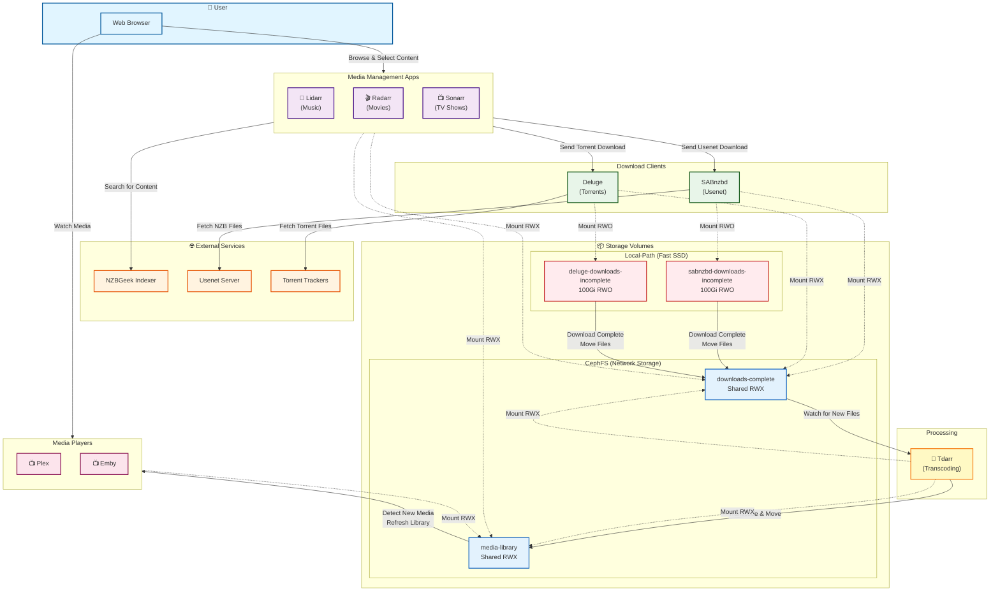

# Homelab Media Architecture

This diagram shows how volumes are shared between media apps and how data flows through the system.

## Volume Sharing & Data Flow Diagram

## Volume Mount Summary

### Apps and Their Volume Mounts

| App | Config | Downloads Incomplete | Downloads Complete | Media Library |
|-----|--------|---------------------|-------------------|---------------|
| **Lidarr** | ✅ lidarr-config (CephFS) | ❌ | ✅ RWX | ✅ RWX |
| **Radarr** | ✅ radarr-config (CephFS) | ❌ | ✅ RWX | ✅ RWX |
| **Sonarr** | ✅ sonarr-config (CephFS) | ❌ | ✅ RWX | ✅ RWX |
| **SABnzbd** | ✅ sabnzbd-config (CephFS) | ✅ sabnzbd-downloads-incomplete (Local-Path, RWO) | ✅ RWX | ❌ |
| **Deluge** | ✅ deluge-config (CephFS) | ✅ deluge-downloads-incomplete (Local-Path, RWO) | ✅ RWX | ❌ |
| **Tdarr** | ✅ tdarr-config (CephFS) | ❌ | ✅ RWX | ✅ RWX |
| **Plex** | ✅ plex-config (CephFS) | ❌ | ❌ | ✅ RWX |
| **Emby** | ✅ emby-config (CephFS) | ❌ | ❌ | ✅ RWX |

### Volume Types

- **RWO**: ReadWriteOnce (single node access)
- **RWX**: ReadWriteMany (multi-node access)
- **Local-Path**: Fast local SSD storage for active downloads
- **CephFS**: Network-attached storage for shared access

## Data Flow Process

1. **User Request**: User browses Lidarr/Radarr/Sonarr and selects content to download
2. **Content Search**: App searches NZBGeek indexer for matching content
3. **Download Request**: 
   - Usenet downloads → SABnzbd
   - Torrent downloads → Deluge
4. **Active Download**: Files downloaded to fast local-path volumes:
   - `/downloads/incomplete` (SABnzbd or Deluge)
5. **Download Complete**: Files moved to shared CephFS volume:
   - `downloads-complete` (mounted at `/downloads/complete`)
6. **Processing**: Tdarr watches `downloads-complete`:
   - Transcodes files to meet quality/codec requirements
   - Moves processed files to `media-library`
7. **Media Detection**: Plex and Emby watch `media-library`:
   - Automatically detect new content
   - Refresh library and make available to users

## Storage Strategy

### Why Two-Stage Download Storage?

1. **Fast Local Storage** (`local-path`):
   - Active downloads benefit from fast SSD I/O
   - Each downloader gets its own 100Gi RWO volume
   - No network latency during active downloads

2. **Shared Network Storage** (`CephFS`):
   - Completed downloads on `downloads-complete` for processing
   - Final media on `media-library` for playback
   - Accessible from all apps across all nodes
   - Persistent and backed up

This architecture ensures optimal performance while maintaining data accessibility across all media services.

